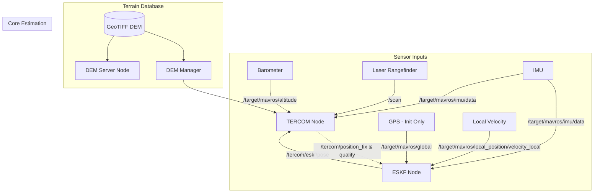
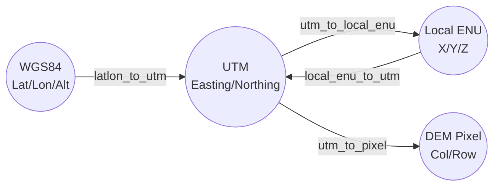
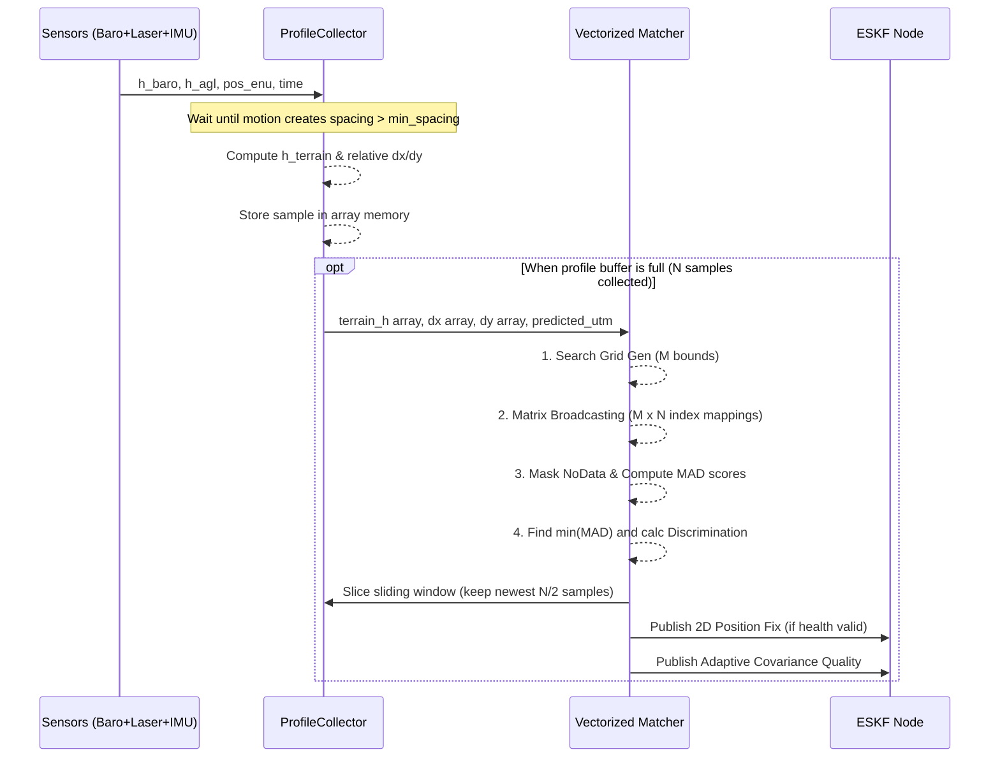
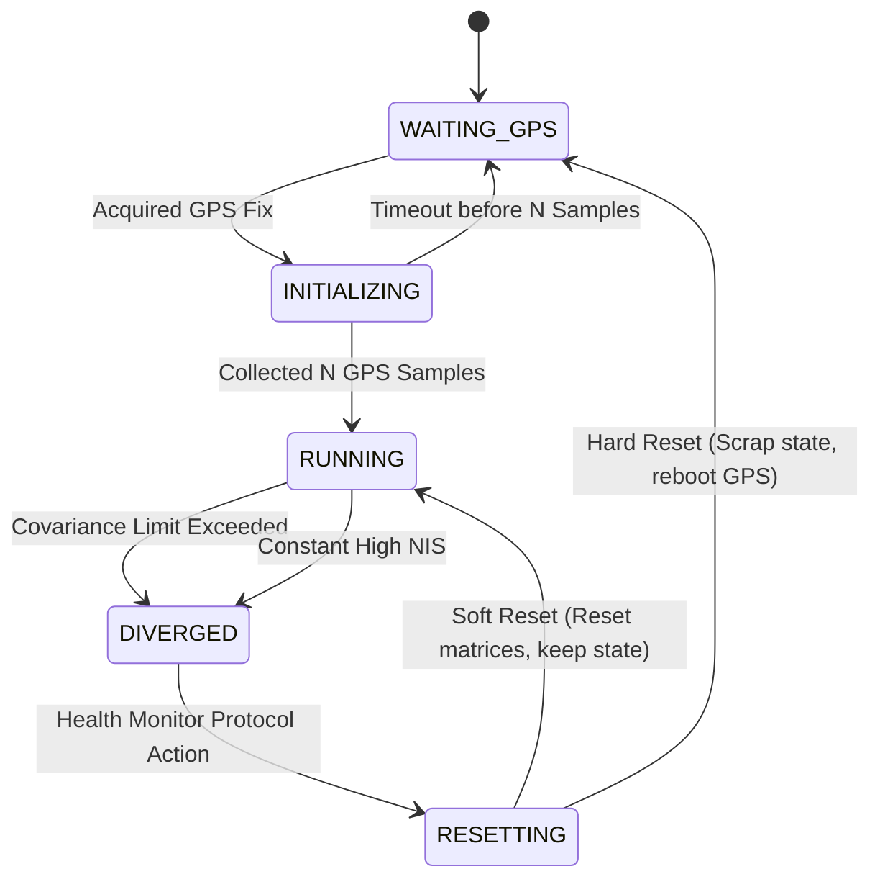

# TERCOM Navigation System: Detailed Code Architecture and Algorithm Steps

This document provides an exhaustive, step-by-step breakdown of the processes, mathematics, and implementation details within the `tercom_nav` ROS 2 package. It is designed to act as a comprehensive guide for developers or for educational instruction, detailing how each Python module processes incoming data.

## Overall System Data Flow

The following diagram illustrates how sensor data flows from the environment, directly via MAVROS, into the core estimation framework and terrain matching pipeline.

---

## 1. Coordinate Utilities (`core/coordinate_utils.py`)

Navigation relies on multiple physical coordinate frames interacting cleanly. The transformations execute precisely as follows:

### Step-by-Step Execution:
1. **Caching Transformers:** `pyproj.Transformer` objects are expensive to initialize. `coordinate_utils.py` uses a module-level dictionary `_transformer_cache` to persistently store and rapidly recall transformers between CRS mappings (e.g., `EPSG:4326` to `EPSG:32637`).
2. **Lat/Lon to UTM (`latlon_to_utm`)**:
   - Computes the proper UTM zone using the integer formula: `zone_number = int((lon + 180) / 6) + 1`.
   - Assigns a Northern (`N`) or Southern (`S`) designation. EPSG code is dynamically built (32600 + zone for North, 32700 + zone for South).
   - Generates Easting and Northing.
3. **UTM to Local ENU (`utm_to_local_enu`)**:
   - Navigation operates within an arbitrary Local ENU boundary avoiding large float imprecisions of absolute UTM values.
   - Easting, Northing, and MSL Altitude are translated by subtracting a predefined `origin_easting`, `origin_northing`, and `origin_alt`.
4. **UTM to DEM Pixel (`utm_to_pixel`)**:
   - Uses the `rasterio.transform.Affine` matrix of the loaded map.
   - Computes sub-pixel precision values via the simple inverse equation:
     - `col_px = (easting - transform.c) / transform.a`
     - `row_px = (northing - transform.f) / transform.e`

---

## 2. DEM Management (`core/dem_manager.py`)

Handles safe memory loading and lookup structures for the Digital Elevation Model map format.

### Loading Step-By-Step:
1. **Initialize File Structure:** Rasterio reads the given `.tif`. If a file has NoData tags, they are immediately overwritten internally by the standard sentinel node value `-9999.0` for safety.
2. **Geographical Reprojection:**
   - If `src_crs.is_geographic` triggers (e.g., simple WGS84 mapping), the script calculates the proper UTM zone using the file's center bounding box.
   - `rasterio.warp.reproject` conducts a full binary bilinear interpolation shifting all data into a Cartesian projected metric layer (UTM) natively, matching the ESKF's format.
3. **Array Population**:
   - Extracts map attributes: `pixel_size_x` (absolute $A$ transform property) and `pixel_size_y` (absolute $E$ transform property).
   - Bounds bounding-box `{west, east, north, south}` limits are statically declared.

### Query Evaluation (`get_elevation` / `get_elevation_batch`):
1. Takes queried Easting/Northing UTM vectors and transforms them sequentially into `col_px` and `row_px` indexes via the affine transform.
2. **Nearest Method**: Performs a rapid `int(round())` clamp index logic against the fast 2D Numpy map matrix.
3. **Bilinear Method**: Resolves corner adjacent sub-pixels ($r0, c0$ to $r1, c1$), queries all 4 grid weights, validates NoData conflicts, and weights mathematically against proximity fractions ($1 - dx$).

---

## 3. The `tercom_node.py` Execution Flow

The TERCOM node is the correlation executor which dictates when positioning updates get formulated.

### Step 1: Callback Synchronization
Data inputs (Barometric altitude, laser-rangefinder, IMU array, Odometry matrix) are notoriously non-synchronic across ROS networks.
- An `ApproximateTimeSynchronizer` pools `Altitude` and `LaserScan` measurements ensuring they represent practically simultaneous time periods (governed by the `sync_slop_s` param).

### Step 2: Processing the Local Sensor Tuple
Once synchronised input triggers `_cb_synced`, TERCOM extracts ground height:
1. Validates the `ranges[0]` index of the `LaserScan`.
2. Checks configuration mapping parameter `rangefinder_is_gimbaled`:
   - **If Gimbaled (True):** `h_agl = raw_range` since the beam explicitly points physically downwards.
   - **If Body-Fixed (False):** The vehicle IMU quaternion ($q$) translates mathematically into roll ($\phi$) and pitch ($\theta$).

$$
     h_{agl} = raw_range \times \cos(\phi) \times \cos(\theta)
$$

3. Resolves global Terrain height ($h_{terrain}$) mapping:
   - $h_{terrain} = h_{baro_{msl}} - h_{agl} - h_{offset_configuration}$ 

### Step 3: Profile Collection and Windowing (`ProfileCollector` class)
- Invokes `try_add_sample`. If metric distancing laws dictate (`distance > min_spacing`), a sample appends to the memory buffer array as a tuple storing $(h_{terrain}, \Delta x_{from_start}, \Delta y_{from_start}, timestamp)$.
- When the buffer caps the user's `max_samples` profile density limit, it asserts readiness into `self._run_matching()`.

### Step 4: Activating Correlation Vector Matches (`match_profile`)
`tercom_matcher.py` bypasses expensive matrix loops, executing a fully broadcasted array match:
1. **Target Generation**: Calculates mathematical offsets converting metric displacement $dx, dy$ vectors directly into spatial `col_px_offset` and `row_px_offset`.
2. **Search Grid Expansion**: Retrieves the ESKF filtered best-assumed geographic central start point. Evaluates a radial zone around it bounded by `search_radius_px` creating combinations forming candidate center starting positions ($M$).
3. **Broadcasting Topology**: Employs `np.meshgrid` arrays to synthesize all $M$ pixel offset combinations against all $N$ path samples establishing a massive $M \times N$ integer lookup indexing dictionary.
4. **Data Aggregation**: Simultaneously rips every target altitude across $M \times N$ paths forming `dem_profiles` from the memory layout. 
5. **Mask Deduplication**: If DEM limits span outside borders, or a pixel reads `-9999.0` it triggers `valid_mask = False`. Computes proportional valid path ratios.
6. **Core MAD Evaluation**:

$$
   \text{MAD}_k = \frac{1}{\text{valid_count}} \sum \left| \text{dem_profiles}_{k} - h_{terrain} \right|
$$

7. **Best Match Selection**: Computes the argmin determining identifying the absolute lowest difference score.

### Step 5: Validating Correlation Health
TERCOM never implicitly trusts the lowest MAD score. Four verifications dictate output:
- **Maximum Absolute Disparity**: Verify the MAD falls below rigid parameter lines (`mad_reject_threshold`).
- **Discrimination Isolation**: Masks out matching arrays mathematically adjacent to the best target mapping ($\approx 3px$ spacing). Determines the second-best globally spaced MAD target. Discrimination equals $M_{second} / M_{first}$. If target similarities fail (`< 1.02`), the engine declares the area "ambiguous" and rejects the update.
- **Roughness Filtering**: Examines standard variance statistics to prevent "Flat-Earth" matches mapping endlessly flat water boundaries.
- **Adaptive Quality Modeling**: Converts standard roughness and discrimination ratios backwards through logarithmic functions modifying the expected positioning tracking noise covariance matrix (`tercom_noise`).

### Step 6: Dispatch
Transmits the newly resolved absolute UTM map correction $X / Y$ values into the `/tercom/position_fix` pipeline, allowing `eskf_node.py` to assimilate the values back into the central navigation estimate algorithm.

---

## 4. The ESKF Implementation (`core/eskf.py` and `nodes/eskf_node.py`)

The Error-State Kalman Filter integrates non-linear absolute physics kinematics (Nominal State) smoothly overlapping with linearized covariance estimates tracking intrinsic uncertainties (Error State).

### 4.1. ESKF Node State Machine

The top-level `eskf_node.py` controls operation dynamically validating the integrity of the filter.

### 4.2. Nominal Predict State Processing (`predict` function)
Executes directly driven by synchronous physical `IMU` updates at native decimation rates:
1. Retrieves high-speed dynamic kinematics from physical accelerometers ($\mathbf{a}_m$) and rate gyros ($\boldsymbol{\omega}_m$).
2. Eliminates state drift biases:
   - $\mathbf{a}_{corr} = \mathbf{a}_m - \mathbf{a}_{bias_k}$
   - $\boldsymbol{\omega}_{corr} = \boldsymbol{\omega}_m - \boldsymbol{\omega}_{bias_k}$
3. Integrates spatial quaternion matrices ($R_{(q)}$) mathematically shifting gravity structures onto absolute maps:

$$
   \mathbf{a}_{enu} = \mathbf{R} \cdot \mathbf{a}_{corr} + \mathbf{g}_{enu}
$$

4. Re-evaluates kinematics directly incrementing basic kinematic tracking values:
   - $\mathbf{p}_{k+1} = \mathbf{p}_k + \mathbf{v}_k \Delta t + 0.5 \mathbf{a}_{enu} \Delta t^2$
   - $\mathbf{v}_{k+1} = \mathbf{v}_k + \mathbf{a}_{enu} \Delta t$
   - $\mathbf{q}_{k+1} = \mathbf{q}_k \otimes \mathbf{q}_{\Delta t}(\boldsymbol{\omega}_{corr} \Delta t)$

### 4.3. Error Matrix Propagations
Simultaneously evaluates mathematical drift uncertainties through continuous time integration matrices.
1. Populates $\mathbf{F}_x$ 15D Transition Array defining kinematic variance mappings:
   - Evaluates pure translation integrals `Fx[0:3, 3:6] = Eye(3)`
   - Computes Cross-Product dependencies for spatial kinematics bridging orientation errors across directional arrays: `Fx[3:6, 6:9] = -R * skew(a_corr)`
   - Extrapolates bias variables tracking Markov chains: `Fx[9:12, 9:12] = -(1/tau) * Eye(3)`
2. Derives system noise covariance matrix $\mathbf{Q}$ mapping variances across temporal domains parameters constants (e.g. `accel_noise^2 * dt`).
3. Executes traditional covariance integrations mathematically combining states:

$$
   \mathbf{P}_{predict} = (\mathbf{I} + \mathbf{F}_x \Delta t) \mathbf{P} (\mathbf{I} + \mathbf{F}_x \Delta t)^T + \mathbf{Q}
$$

### 4.4. Measurement Interrogation and Kalman Output (`update_xxx` routines)
Executes asynchronously whenever disparate measuring tools signal metrics. Examples include $z_{xy}$ mapping TERCOM fixes against uncertainty $\mathbf{R}_{xy}$.
1. **Jacobian Structure Configuration**: The script aligns standard arrays matching positional error matrix dependencies. Because Error States represent absolute values directly matched inside physical coordinates, $\mathbf{H}$ arrays evaluate completely linearly. A classic TERCOM positional mapping array formulates: `H[0,0] = 1` and `H[1,1] = 1`.
2. **Measurement Assessment**: Formulates raw mathematical Innovation mappings comparing absolute expectations: $\mathbf{y} = \mathbf{z} - p_{predicted_xy}$.
3. **Optimal Gain Resolution**:
   - Solves measurement matrices structures: $\mathbf{S} = \mathbf{H} \mathbf{P} \mathbf{H}^T + \mathbf{R}$
   - Checks normalized Mahalanobis conditions assuring Innovation validity bounds: `NIS = y * S^{-1} * y^T`
   - Formulates Kalman ratio evaluations determining exactly how thoroughly system integrations must respect incoming values: $\mathbf{K} = \mathbf{P} \mathbf{H}^T \mathbf{S}^{-1}$

### 4.5. Injection and Feedback State Cleansing
The primary differentiator for the Error-State Kalman formulation executes inside optimal recovery matrices. 
1. Calculates positional discrepancy shifts vectors: $\delta \mathbf{x} = \mathbf{K} \cdot \mathbf{y}$
2. Injects direct correction adjustments globally mapping into fundamental Nominal state mechanics variables:
   - $\mathbf{p} = \mathbf{p} + \delta\mathbf{x}_{[0:3]}$
   - $\mathbf{v} = \mathbf{v} + \delta\mathbf{x}_{[3:6]}$
   - Converts the variance angles ($\delta \theta$) back through small rotation approximation formulas merging nonlinearly across quaternion states.
   - Adjusts internal IMU sensor biases mapping corrections directly eliminating fundamental drift properties.
3. Overwrites existing algorithmic Uncertainty Variance Matrix formulas utilizing physically rigorous "Joseph-Form" stabilizing numerical algorithms ensuring perfectly conditioned symmetric matrices structure:

$$
   \mathbf{P}_{new} = (\mathbf{I} - \mathbf{K}\mathbf{H}) \mathbf{P} (\mathbf{I} - \mathbf{K}\mathbf{H})^T + \mathbf{K}\mathbf{R}\mathbf{K}^T
$$

4. **Mandatory Purge Validation**: Destroys spatial variance matrices ($\delta \mathbf{x} = 0$) entirely completing Error State evaluation loop. The routine proceeds fully normalized.

### 4.6. Why ESKF is Superior to Standard EKF

The Error-State Kalman Filter offers significant mathematical and computational advantages over the traditional Extended Kalman Filter (EKF), specifically in 3D inertial navigation:

1. **Orientation Representation (Avoiding Gimbal Lock):**
   - The nominal state maintains the orientation using a **quaternion**, which is free of singularities (like gimbal lock).
   - In a standard EKF, tracking the covariance of a 4D unit quaternion is mathematically problematic because the quaternion elements are constrained ($||q|| = 1$). 
   - The ESKF solves this by representing the **angular error as a minimal 3D rotation vector** ($\delta \boldsymbol{\theta}$). Since this error state is always close to zero, it completely avoids constraint violations and singularities.

2. **Linear Error Dynamics:**
   - The nominal state undergoes highly non-linear, large-scale kinematic integration (e.g., fast vehicle rotations and accelerations).
   - The error state ($\delta \mathbf{x}$) only tracks small, slowly changing uncertainties. Because $\delta \mathbf{x}$ is microscopic, the error-state kinematics can be safely and accurately **linearized**. This makes the Jacobians ($\mathbf{F}$ and $\mathbf{H}$) simpler and numerically much more stable than linearizing the full-state dynamics as an EKF would.

3. **Decoupled Operation:**
   - In ESKF, high-frequency IMU data processes immediately into the nominal state, decoupled from the heavy covariance matrix math.
   - The computationally expensive covariance propagation and Kalman updates (which require matrix inversions) can run asynchronously at slower rates only when observation data (like TERCOM) arrives.

4. **Measurement Jacobians are Trivial:**
   - Because the error state maps directly to physical axes (e.g., $\delta \mathbf{p}$ is directly $X, Y, Z$ metric error), taking a derivative against a position constraint is trivial. The Jacobian $\mathbf{H}$ consists purely of `1.0`s and `0.0`s, saving CPU cycles heavily compared to an EKF.
