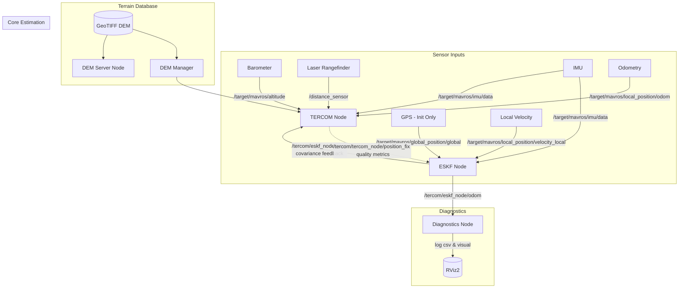
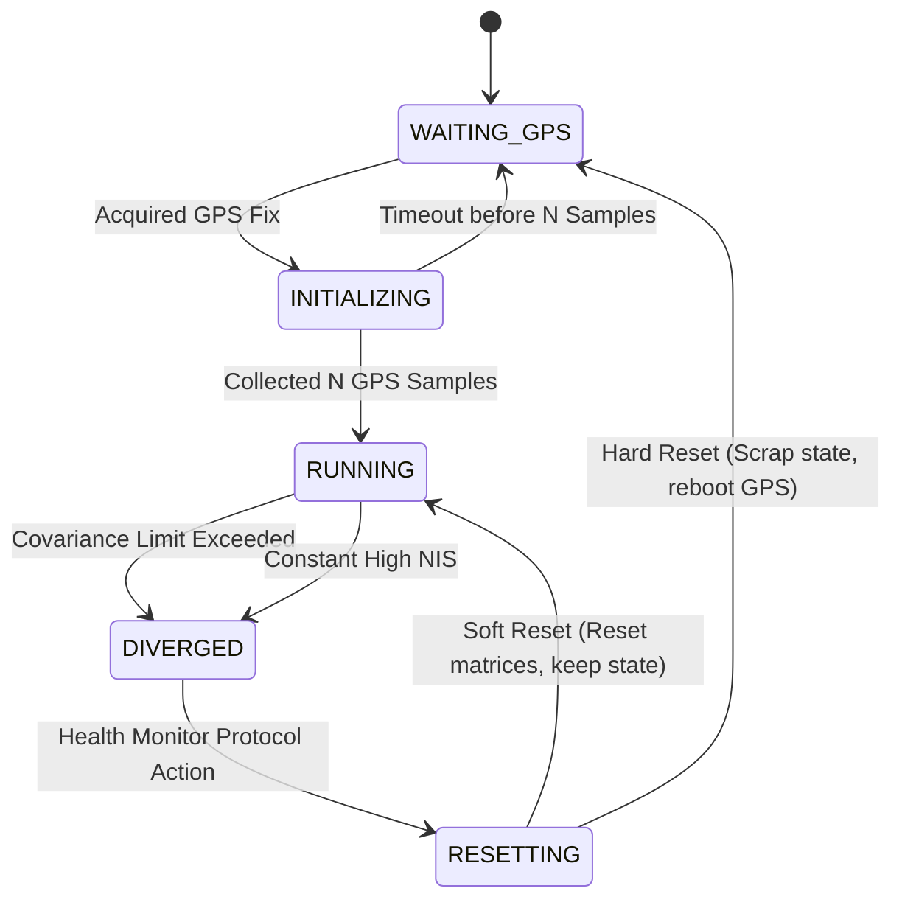
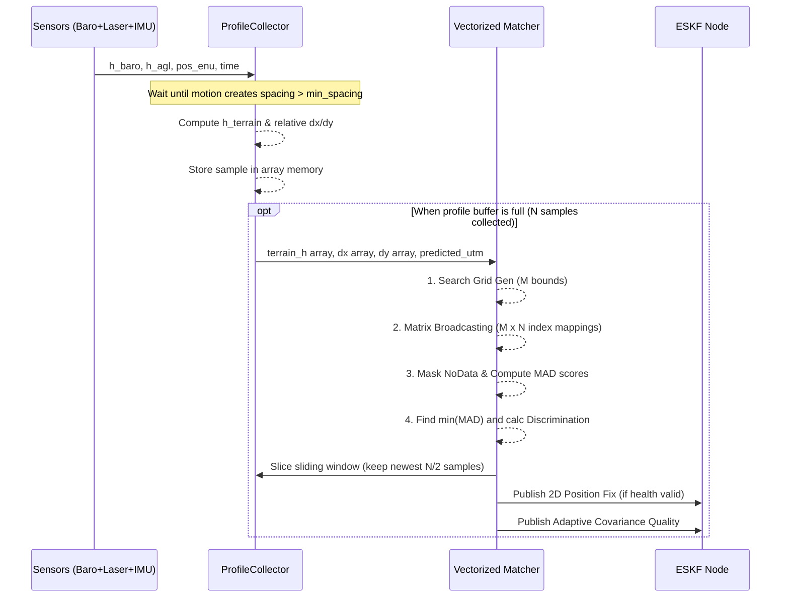
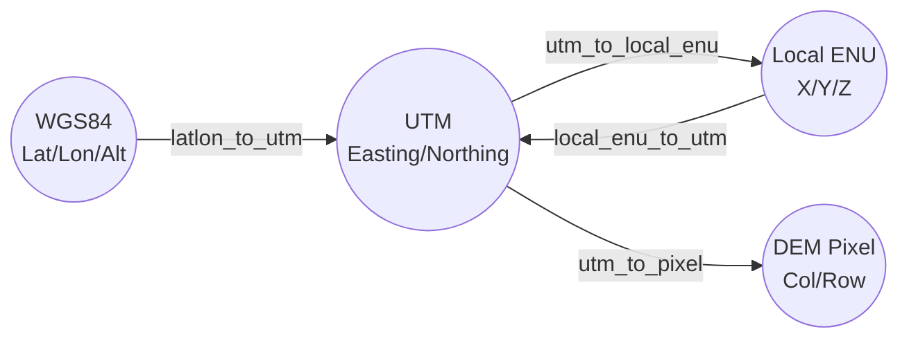
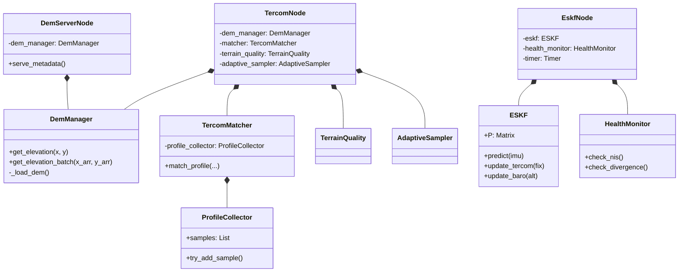

# TERCOM Navigation Mermaid Diagrams

This document contains a comprehensive collection of Mermaid diagrams depicting the architecture, states, algorithms, and data flows of the `tercom_nav` package.

## 1. System Architecture Data Flow
Shows the high-level data flow from sensors and DEMs to the ESKF and TERCOM matching nodes.


## 2. ESKF Node State Machine
The top-level state machine handling the initialization and health of the Error-State Kalman Filter.


## 3. ESKF Filter Lifecycle (Predict & Update)
Detailed algorithmic loop of the Error-State Kalman Filter, outlining nominal state kinematics and error state covariance updates.
```mermaid
graph TD
    A[Start Loop] --> B{Data Received?}
    B -- IMU Msg --> C[Predict Step]
    C --> C1[Nominal State Integration]
    C1 --> C2[Error Covariance Prop P = F*P*F'+Q]
    C2 --> B
    
    B -- TERCOM Fix / Baro / Vel --> D[Update Step]
    D --> D1[Calc Innovation y = z - H*x]
    D1 --> D2[Check NIS & Health bounds]
    D2 --> D3[Calculate Kalman Gain K = P*H'*inv(H*P*H'+R)]
    D3 --> D4[Error State Correction dx = K*y]
    D4 --> D5[Inject dx into Nominal State p, v, q, b]
    D5 --> D6[Update Covariance P = (I-KH)P(I-KH)' + KRK']
    D6 --> D7[Reset Error State dx = 0]
    D7 --> B
```

## 4. TERCOM Sequence Diagram
Interaction between the different components handling profile collection and matching.


## 5. Coordinate Map Transformation
Shows the coordinate reference systems and how spatial data is converted in `core/coordinate_utils.py`.


## 6. Core Modules Class Architecture
Class structure of the Python backend.

